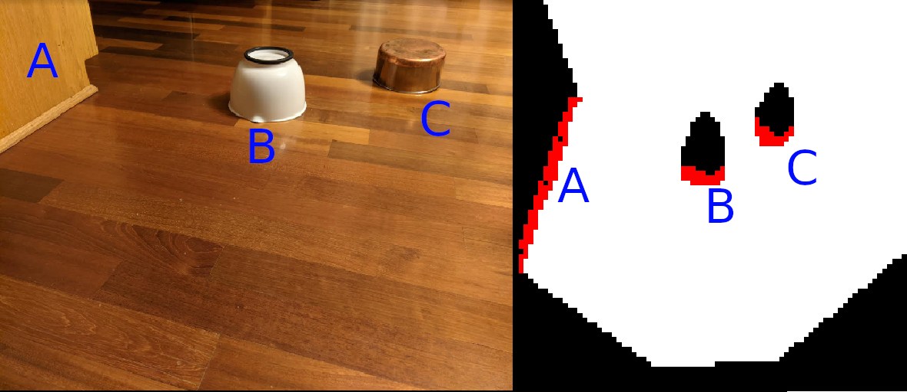

I wrote this for [IRIS, a robotics team at UIUC](https://github.com/IllinoisRoboticsInSpace) to control a robot.

This program receives raw input from an Xbox 360 Kinect using the open source library [OpenKinect/libfreenect](https://github.com/OpenKinect/libfreenect) and processes it into a useful, simple, 2D space of passable and unpassable grid locations using the Kinect's accelerometer and infrared depth sensors. It fed this grid info to [ROS](https://www.ros.org/) via a [ROS Node](http://wiki.ros.org/Nodes) which would have used it for navigation, but the localization part of the team fell through and our robot was not autonomous at all that year :( This code did get used by future IRIS teams, but I'm not sure how much.

I couldn't find original images it produced, and I don't have my Kinect anymore, so I recreated the kind of image it would produce:
 

detection_raw is what would be used on the robot. It only gathers the data, and then sends it to a ros node, and or a text file.

detection_gl is the human debug version. It outputs it to a screen.

detection_opengl is an old version of detection_gl.

[IRIS's repository of this code](https://github.com/IllinoisRoboticsInSpace/IRIS_V_control/tree/master/obstacle_detection/src)
